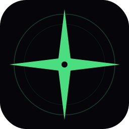

<div align="center">



# YouDownload

**Футуристичный десктопный загрузчик для YouTube и 1000+ сайтов**

[](https://github.com/warfa/YouDownload/releases)
[](https://github.com/warfa/YouDownload/releases)
[](https://www.electronjs.org/)
[](https://github.com/yt-dlp/yt-dlp)

</div>

---

## Возможности

**Видео**
- Качество: 4K / 1440p / 1080p / 720p / 480p / 360p
- Формат: MP4 (автослияние видео и аудио через ffmpeg)
- YouTube, YouTube Music, Shorts, плейлисты

**Аудио**
- MP3: лучшее качество / 192 kbps / 128 kbps
- M4A: лучшее качество

**Интерфейс**
- Прогресс загрузки в реальном времени (скорость, ETA, прогресс-бар)
- Очередь загрузок с возможностью отмены
- История загрузок (до 200 записей), сохраняется между сессиями
- Предпросмотр видео: обложка, длительность, просмотры
- Два языка: **русский** и **английский** — переключение в один клик
- Все настройки сохраняются между запусками (язык, качество, папка, тема)

**Темы**
- **FleetWatch** — глубокий чёрный, зелёно-циановые акценты, шрифт Orbitron, HUD-эстетика
- **Vulnerable Apathy** — glassmorphism, анимированные неоновые орбы (розовый + синий), шрифт Syncopate, inspired by blackbear - idfc

---

## Скриншоты

| FleetWatch | Vulnerable Apathy |
|---|---|
| Тёмный HUD с зелёными акцентами | Glassmorphism с розово-синими орбами |

---

## Установка

Перейди в [**Releases**](https://github.com/warfa/YouDownload/releases) и скачай последний установщик.

```
YouDownload Setup 1.0.1.exe
```

Запусти, следуй установщику — готово. При первом запуске приложение автоматически скачает движок yt-dlp (~10 МБ).

---

## Требования

- **Windows 10 / 11** x64
- **Node.js 18+** — [nodejs.org](https://nodejs.org) *(нужен для JS runtime yt-dlp)*
- **ffmpeg** *(рекомендуется)* — для слияния видео и аудио при качестве 1080p+

```powershell
winget install Gyan.FFmpeg
```

---

## Cookies и YouTube

Для большинства видео куки не нужны — приложение использует iOS/web клиент yt-dlp.

Если YouTube всё же блокирует загрузку:
1. Установи расширение **"Get cookies.txt LOCALLY"** в Chrome/Edge
2. Зайди на youtube.com (убедись что залогинен)
3. Нажми расширение → **Export** → сохрани `cookies.txt`
4. В настройках приложения укажи путь к файлу

---

## Сборка из исходников

```bash
git clone https://github.com/warfa/YouDownload.git
cd YouDownload

# Установить зависимости
npm install --include=dev

# Dev-режим
npm run dev

# Генерация иконок (нужен: npm install -g sharp-cli)
npm run build:icon

# Сборка + установщик
npm run build
npx electron-builder --win
```

Результат: `dist/YouDownload Setup 1.0.1.exe`

---

## Структура проекта

```
YouDownload/
├── src/
│   ├── main/          # Electron main process (IPC, yt-dlp, electron-store)
│   ├── preload/       # Context bridge
│   └── renderer/src/
│       ├── App.tsx           # Весь UI + логика
│       ├── i18n.ts           # Переводы EN/RU
│       ├── storage.ts        # Персистентное состояние через IPC
│       ├── globals.css       # Тема FleetWatch
│       └── theme-apathy.css  # Тема Vulnerable Apathy
├── resources/
│   └── icon.svg       # Исходная иконка
├── build/             # Сгенерированные иконки (icon.ico, icon.png)
├── scripts/
│   └── gen-icon.mjs   # Генерация иконок из SVG
└── bin/
    ├── yt-dlp.exe     # Движок загрузки (скачивается автоматически)
    └── cookies.txt    # YouTube cookies (опционально)
```

---

## Стек

| Слой | Технология |
|---|---|
| Framework | Electron 33 |
| Frontend | React 18 + TypeScript |
| Bundler | electron-vite + electron-builder |
| Движок загрузки | yt-dlp via yt-dlp-wrap |
| Хранилище | electron-store |
| Шрифты | Orbitron, Barlow Condensed, Syncopate, Space Grotesk, Azeret Mono |

---

## Лицензия

MIT
